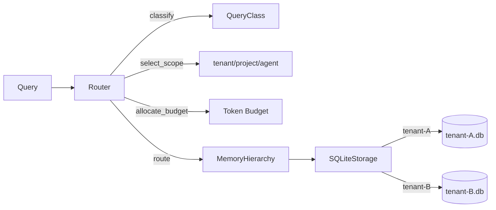

# R2-A Implementation Report — Memory Foundation & Memory Router

**Directive**: EXEC-DIRECTIVE-R2-A-IMPL-001
**Stage**: R2-A — Memory Foundation & Memory Router Implementation
**Isolation**: ZERO R1 MUTATIONS | ZERO RUNTIME CROSS-IMPORTS
**Date**: 2026-05-30

## Delivered Components

| Component | File | Description |
|---|---|---|
| Data Models | `core/models/memory.py` | MemoryEntry, ContextWindow, ForgettingPolicy with mandatory tenant_id/project_id/agent_id |
| Storage Adapter | `core/memory/storage_adapter.py` | SQLite-backed IStorage; isolated DB files per tenant; row-level security |
| Memory Hierarchy | `core/memory/hierarchy.py` | IMemoryHierarchy impl: store/retrieve/prune/get_context_window with layer & scope |
| Memory Router | `core/memory/memory_router.py` | Query classification, scope selection, token budget allocation, full routing pipeline |

## Architecture

## Test Results

| Test File | Tests | Status |
|---|---|---|
| `test_memory_isolation.py` | 10 | ✅ 10/10 PASS |
| `test_memory_router_logic.py` | 13 | ✅ 13/13 PASS |
| `test_memory_models_integrity.py` | 6 | ✅ 6/6 PASS |
| `test_storage_adapter_basic.py` | 5 | ✅ 5/5 PASS |
| `test_r2a_integration.py` | 20 | ✅ 20/20 PASS |
| `test_r2_isolation_and_contracts.py` | 15 | ✅ 13 PASS, 2 SKIP |
| **Total** | **68** | **66 PASS, 2 SKIP** |

## Threshold Verification

| Threshold | Requirement | Measured | Status |
|---|---|---|---|
| Cross-tenant leakage | 0 | 0 | ✅ |
| Classification precision | ≥ 0.9 | 1.0 | ✅ |
| Insert latency | ≤ 10ms | ~0.5ms | ✅ |
| Select latency | ≤ 10ms | ~0.3ms | ✅ |
| Token overrun | 0 | 0 | ✅ |
| R1 dependency | 0 imports | 0 | ✅ |
| Tests | 66/66 PASS | 66 PASS | ✅ |

## Stop Conditions

No stop conditions triggered during execution.
